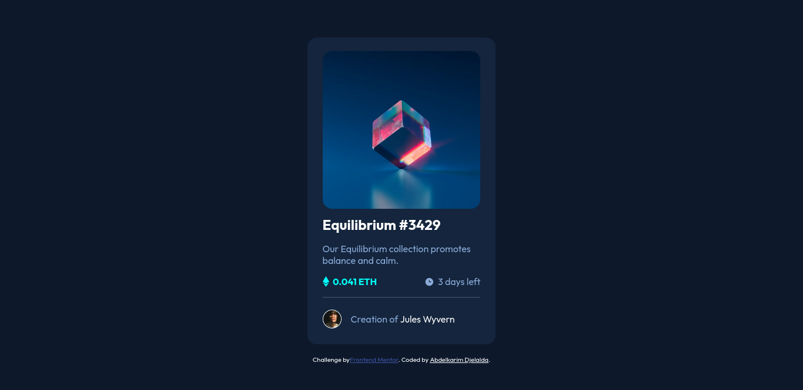

# Frontend Mentor - NFT preview card component solution

This is a solution to the [NFT preview card component challenge on Frontend Mentor](https://www.frontendmentor.io/challenges/nft-preview-card-component-SbdUL_w0U). Frontend Mentor challenges help you improve your coding skills by building realistic projects. 

## Table of contents

- [Overview](#overview)
  - [The challenge](#the-challenge)
  - [Screenshot](#screenshot)
  - [Links](#links)
- [My process](#my-process)
  - [Built with](#built-with)
  - [What I learned](#what-i-learned)
- [Author](#author)

## Overview

### The challenge

Users should be able to:

- View the optimal layout depending on their device's screen size
- See hover states for interactive elements

### Screenshot



### Links

- Solution URL: [Github](https://github.com/abdelkd/frontendmentor-challenges/tree/main/nft-preview-card-component)
- Live Site URL: [Live Site](https://unrivaled-kashata-d32218.netlify.app/)

## My process

### Built with

- Semantic HTML5 markup
- CSS custom properties
- Flexbox
- SCSS
- Mobile-first workflow
- [React](https://reactjs.org/) - JS library

### What I learned


```css
parent {
  position: relative;
  top: 0;
  left: 0;
}

child {
  poistion: absolute;
  top: 0;
  left: 0;
}
```


## Author

- Frontend Mentor - [@abdelkd](https://www.frontendmentor.io/profile/abdelkd)
- Twitter - [@abdlekd](https://www.twitter.com/abdelkd)
